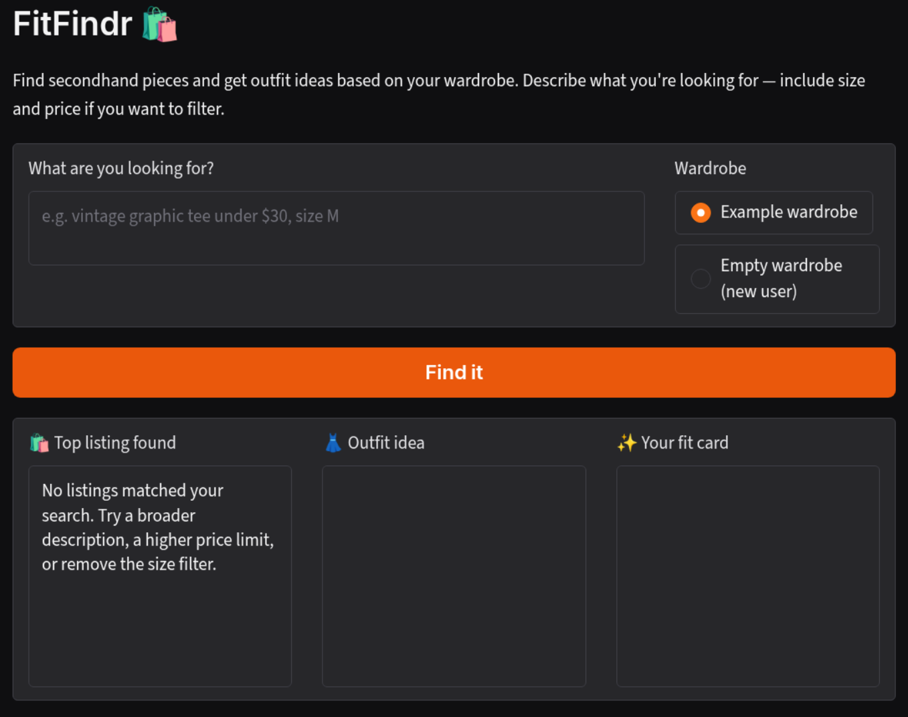

# FitFindr

A thrift-shopping assistant that searches secondhand listings, suggests outfits built around the find, and generates a shareable social media caption. All from a single natural language search.

## Video Demo

[Watch on YouTube](https://youtu.be/6D-txxWCuP0)



## Setup

```bash
pip install -r requirements.txt
```

Add your Groq API key to a `.env` file in the project root:

```
GROQ_API_KEY=your_key_here
```

Run the app:

```bash
.venv/bin/python app.py
```

Then open http://localhost:7860 in your browser.

---

## Tool Inventory

### Tool 1: `search_listings(description: str, size: str | None, max_price: float | None) → list[dict]`

Searches the mock listings dataset for secondhand items matching the user's description, with optional size and price filters.

- **description:** free-text keywords (e.g. `"vintage graphic tee"`). Scored by keyword overlap across title, description body, category, style tags, and colors.
- **size:** optional size string. Handles five formats: letter/range sizes (`S`, `M/L`) via token split; waist sizes (`W30`, `W30 L30`) via prefix match; US shoe sizes (`US 8`) via exact match; One Size variants always pass.
- **max_price:** optional price ceiling (inclusive). Listings above this are dropped before scoring.

Returns a list of listing dicts sorted by relevance score (highest first). Each dict contains: `id`, `title`, `description`, `category`, `style_tags` (list), `size`, `condition` (excellent / good / fair), `price` (float), `colors` (list), `brand` (str or None), and `platform` (depop / thredUp / poshmark). Returns an empty list if nothing matches, it never raises an exception.

---

### Tool 2: `suggest_outfit(new_item: dict, wardrobe: dict) → str`

Uses an LLM to suggest 1–2 outfits built around the thrifted item and the user's existing wardrobe.

- **new_item:** a listing dict from `search_listings` (title, category, colors, style_tags, condition).
- **wardrobe:** a dict with an `items` key containing wardrobe item dicts (name, category, colors, style_tags, notes).

Returns a non-empty string. When the wardrobe has items, the suggestions name specific pieces from it. When the wardrobe is empty, the LLM falls back to general styling advice.

---

### Tool 3: `create_fit_card(outfit: str, new_item: dict) → str`

Uses an LLM to generate a short, casual Instagram/TikTok caption for the outfit.

- **outfit:** the outfit suggestion string returned by `suggest_outfit`.
- **new_item:** the listing dict for the thrifted item; `title`, `price`, and `platform` are pulled into the caption.

Returns a 1–3 sentence string written in a casual OOTD voice. Called at higher temperature (1.2) so outputs vary across runs.

---

## Planning Loop

The agent runs a fixed sequence with one early-exit branch:

1. **Parse the query:** regex extracts `description`, `size`, and `max_price` from free text so the search tool receives typed inputs instead of a raw sentence.

2. **Call `search_listings`:** finds real listings that match what the user described. This runs first because there is nothing to style or caption if no item is found. If the result is empty, the agent sets `session["error"]` and returns immediately; `suggest_outfit` and `create_fit_card` are never called because they have nothing to work with.

3. **Call `suggest_outfit`:** takes the top-ranked listing and the user's wardrobe and asks the LLM to build outfit ideas around the specific piece. This runs second because the outfit suggestions need the actual item details (colors, style tags, category) from step 2. The agent can't generate them without knowing what was found.

4. **Call `create_fit_card`:** takes the outfit suggestion from step 3 and turns it into a shareable caption. This runs last because the caption is a summary of the full look, which can only be written after both the item and the outfit are known.

5. **Return the session dict:** all three outputs (`selected_item`, `outfit_suggestion`, `fit_card`) are available for the UI to display.

---

## State Management

All intermediate values are stored in a session dict initialized at the start of each run. The planning loop reads from the session dict and passes values as explicit function arguments, tools never read the session directly. For example, after `search_listings` returns, the loop stores `results[0]` in `session["selected_item"]` and then passes it as `new_item=session["selected_item"]` when calling `suggest_outfit`. The same pattern repeats: `session["outfit_suggestion"]` is passed as `outfit=` to `create_fit_card`. This keeps each tool self-contained and independently testable.

| Key                 | Set after                  | Used by                             |
| ------------------- | -------------------------- | ----------------------------------- |
| `wardrobe`          | Session start              | `suggest_outfit`                    |
| `parsed`            | Query parsing              | `search_listings` call              |
| `search_results`    | `search_listings`          | Early-exit check                    |
| `selected_item`     | `search_listings` succeeds | `suggest_outfit`, `create_fit_card` |
| `outfit_suggestion` | `suggest_outfit`           | `create_fit_card`                   |
| `fit_card`          | `create_fit_card`          | Final output                        |
| `error`             | Early exit                 | Returned to UI                      |

---

## Error Handling

### `search_listings` — no results

When no listings match the description, size, and price combination, the tool returns an empty list. The agent detects this, sets `session["error"]`, and stops without calling the remaining two tools.

```
query: "designer ballgown size XXS under $5"
→ session["error"]: "No listings matched your search. Try a broader description,
   a higher price limit, or remove the size filter."
→ session["fit_card"]: None
→ suggest_outfit: never called
```

### `suggest_outfit` — empty wardrobe

When `wardrobe["items"]` is an empty list, the tool does not fail or return an empty string. It builds a different prompt asking the LLM for general styling advice instead of wardrobe-specific combinations.

```python
results = search_listings("vintage graphic tee", size=None, max_price=50)
print(suggest_outfit(results[0], get_empty_wardrobe()))
```

```
"This Y2K baby tee would pair perfectly with high-waisted mom jeans and chunky
sneakers for a nostalgic, casual look, or with a flowy midi skirt and sandals
for a whimsical, cottagecore-inspired outfit. The tee's playful butterfly print
also lends itself to being layered under a cardigan or denim jacket for a more
polished, vintage-inspired aesthetic."
```

### `create_fit_card` — empty outfit string

When `outfit` is empty or whitespace-only, the tool returns a descriptive error string before calling the LLM.

```python
results = search_listings("vintage graphic tee", size=None, max_price=50)
print(create_fit_card("", results[0]))
```

```
"No outfit suggestion was available to generate a caption from."
```

---

## AI Usage

### Instance 1 - Implementing `suggest_outfit`

**Input given:** The full Tool 2 from planning.md inputs with parameter names and types, both wardrobe branches (empty vs. populated), the return value contract ("always a non-empty string"), and the failure mode. Also included the `example_wardrobe` from `wardrobe_schema.json` so the model could see the exact field names (`name`, `category`, `colors`, `style_tags`, `notes`).

**What it produced:** A working two-branch implementation: the empty-wardrobe branch prompts the LLM for general styling advice; the populated-wardrobe branch formats each wardrobe item as a line listing name, category, colors, and style tags, then asks the LLM to name specific pieces in 1–2 outfit combinations.

**What I changed:** The initial sentence-length constraints in both prompts were too loose "2–4 sentences" (empty branch) and "3–5 sentences" (wardrobe branch). Testing showed the LLM used all the room it was given and the outfit panel filled up with text. I changed them to "1–2 sentences" and "2–3 sentences" so the output fits the UI panel cleanly.

---

### Instance 2 - Implementing `run_agent`

**Input given:** The Planning Loop section of planning.md (the three numbered steps with the early-exit condition), the State Management table (which key is set when and used by which tool), and the Mermaid architecture diagram showing the exact branch on empty results.

**What it produced:** The full `run_agent()` implementation plus a regex-based `_parse_query()` helper that extracts `description`, `size`, and `max_price` from free text. The loop initializes the session dict, parses the query, calls the three tools in order, and returns early with `session["error"]` if `search_listings` returns empty.

**What I verified before trusting it:** I ran the loop with a function patched over `suggest_outfit` and `create_fit_card` to confirm the exact dict stored in `session["selected_item"]` was the same object passed into `suggest_outfit`, and that `session["outfit_suggestion"]` matched the string received by `create_fit_card`, ruling out any hardcoded values between steps. I also ran the no-results path with a spy that would raise if `suggest_outfit` was called, confirming the early exit branch works correctly.

---

## Spec Reflection

**One way the spec helped:** The diagram in planning.md made `run_agent()` straightforward to implement. Knowing in advance which key held which value and which tool consumed it meant that there was no ambiguity about what to extract from the session at each step.

**One way implementation diverged from the spec:** The spec describes `suggest_outfit` as returning "1–2 complete outfit suggestions" but says nothing about length. The initial implementation gave the LLM no length constraint and it consistently produced 3–5 sentences, which were too long and overflow the UI panel. I added explicit sentence limits to both prompt branches ("1–2 sentences" for the empty-wardrobe branch, "2–3 sentences" for the wardrobe branch) to keep outputs panel-sized. This wasn't in the spec because the spec focused on correctness (non-empty return, two branches, named wardrobe pieces), not presentation.
