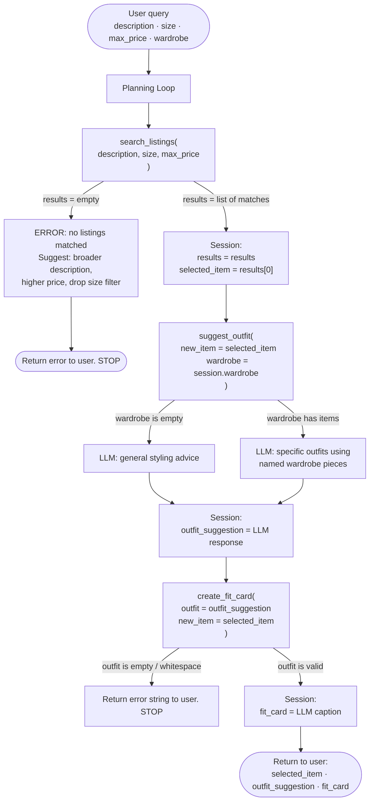

# FitFindr — planning.md

> Complete this document before writing any implementation code.
> Your spec and agent diagram are what you'll use to direct AI tools (Claude, Copilot, etc.) to generate your implementation — the more specific they are, the more useful the generated code will be.
> Your planning.md will be reviewed as part of your submission.
> Update it before starting any stretch features.

---

## Tools

List every tool your agent will use. For each tool, fill in all four fields.
You must have at least 3 tools. The three required tools are listed — add any additional tools below them.

### Tool 1: search_listings

**What it does:**
Searches the mock listings dataset for secondhand items that match the user's description, optionally filtering by size and price max. Returns the matching listings sorted by relevance so the agent can pick the best fit.

**Input parameters:**

- `description` (str): Text describing what the user wants (e.g. "vintage graphic tee"). Used to score each listing by keyword overlap across title, style tags, category, colors, and description body.
- `size` (str): Optional size string to filter by. Pass `None` to skip size filtering. The dataset has five size formats that each need their own matching logic:
    - **Letter and range sizes** (`S`, `M`, `L`, `XL`, `S/M`, `M/L`, `L/XL`): split the listing size on `/`, spaces, and parentheses, then check if the user's size equals any of the resulting tokens (case-insensitive). So `"L"` matches `"L"`, `"M/L"`, and `"L/XL"` (all contain `"L"` as a token) but does not match `"XL"`.
    - **Waist sizes** (e.g. `W28`) and **waist+length** (e.g. `W30 L30`): check whether the listing size starts with the user's input (e.g. `"W30"` matches both `"W30"` and `"W30 L30"`).
    - **US shoe sizes** (e.g. `US 8`): exact match only — `"US 8"` must not match `"US 8.5"`.
    - **One Size variants**: always pass the size filter regardless of what the user entered.
- `max_price` (float): Optional price ceiling, so the model only shows listings at or below this amount are returned. Pass `None` to skip price filtering.

**What it returns:**
A list of listing dicts sorted by relevance score (highest first). Each dict contains: `id`, `title`, `description`, `category`, `style_tags` (list), `size`, `condition` (excellent / good / fair), `price` (float), `colors` (list), `brand` (str or None), and `platform` (depop / thredUp / poshmark / other). Returns an empty list if nothing matches. NEVER raises an exception.

**What happens if it fails or returns nothing:**
If the list is empty, the agent tells the user no listings matched their query and suggests specific adjustments. For example try a broader description, a higher price limit, or removing the size filter, then stops. It does not call `suggest_outfit` with empty input.

---

### Tool 2: suggest_outfit

**What it does:**
Given the thrifted item the user is considering and their existing wardrobe, uses an LLM to suggest 1–2 complete outfits that incorporate the new piece with specific items already in their closet.

**Input parameters:**

- `new_item` (dict): The top listing returned by `search_listings`, which contains `title`, `category`, `colors`, `style_tags`, `price`, and `platform`.
- `wardrobe` (dict): The user's wardrobe in the format defined by `wardrobe_schema.json` — a dict with an `items` key containing a list of wardrobe item dicts. Each item has `id`, `name`, `category`, `colors`, `style_tags`, and an optional `notes` field.

**What it returns:**
A non-empty string with 1–2 outfit suggestions. When the wardrobe has items, the suggestions name specific pieces from the wardrobe (e.g. "pair with your wide-leg jeans and chunky sneakers"). When the wardrobe is empty, the suggestions describe general styling ideas — what types of bottoms, shoes, or layers work with the item and what aesthetic it fits.

**What happens if it fails or returns nothing:**
If the wardrobe is empty, the tool does not fail, it falls back to general styling advice from the LLM instead of wardrobe-specific combinations. The tool always returns a non-empty string; it never raises an exception or returns an empty string.

---

### Tool 3: create_fit_card

**What it does:**

Uses an LLM to generate a short, shareable social media caption for the outfit built around the thrifted find and written in the casual voice of a real OOTD (Outfit of the Day) post, not a product description.

**Input parameters:**

- `outfit` (str): The outfit suggestion string returned by `suggest_outfit`.
- `new_item` (dict): The listing dict for the thrifted item is used to pull `title`, `price`, and `platform` into the caption naturally.

**What it returns:**
A 1–3 sentence string styled as an Instagram/TikTok caption. It mentions the item name, price, and platform once each, captures the specific vibe of the outfit, and sounds authentic and casual. The LLM is called at higher temperature so the output feels fresh and different for different inputs.

**What happens if it fails or returns nothing:**
If `outfit` is empty or whitespace-only, the tool returns a descriptive error string explaining that no outfit suggestion was available — it does not raise an exception. The agent surfaces that message to the user instead of generating a caption with no content.

---

### Additional Tools (if any)

<!-- Copy the block above for any tools beyond the required three -->

---

## Planning Loop

**How does your agent decide which tool to call next?**

<!-- Describe the logic your planning loop uses. What does it look at? What conditions change its behavior? How does it know when it's done? -->

The loop always runs the same three steps in order, with an early exit after the first step if nothing is found:

1. **Call `search_listings`** with the description, size, and max_price extracted from the user's message. Store the result in `results`.
    - If `results` is empty: store an error message in the session explaining what the user could adjust (broader description, higher price, no size filter), return that message to the user, and stop, do not proceed to step 2.
    - If `results` is not empty: set `selected_item = results[0]` (the highest-relevance match) and continue.

2. **Call `suggest_outfit`** with `new_item=selected_item` and `wardrobe=session["wardrobe"]`. Store the result in `outfit_suggestion`.
    - The tool always returns a non-empty string, so no early exit here. Continue to step 3.

3. **Call `create_fit_card`** with `outfit=outfit_suggestion` and `new_item=selected_item`. Store the result in `fit_card`.
    - Return all three outputs to the user: the matched listing details, the outfit suggestion, and the fit card caption. The loop is done.

---

## State Management

**How does information from one tool get passed to the next?**

<!-- Describe how your agent stores and accesses state within a session. What data is tracked? How is it passed between tool calls? -->

The agent maintains a session dict initialized at the start of each conversation and updated after each tool call:

| Key                 | Set when                                                         | Used by                             |
| ------------------- | ---------------------------------------------------------------- | ----------------------------------- |
| `wardrobe`          | Session start, loaded via `get_example_wardrobe()` or user input | `suggest_outfit`                    |
| `results`           | After `search_listings` returns                                  | Planning loop empty check           |
| `selected_item`     | After `search_listings` succeeds — set to `results[0]`           | `suggest_outfit`, `create_fit_card` |
| `outfit_suggestion` | After `suggest_outfit` returns                                   | `create_fit_card`                   |
| `fit_card`          | After `create_fit_card` returns                                  | Final output to user                |

Each tool receives its inputs as explicit function arguments, the planning loop reads from the session dict and passes the values directly. Tools do not read from the session themselves.

---

## Error Handling

For each tool, describe the specific failure mode you're handling and what the agent does in response.

| Tool              | Failure mode                                                                     | Agent response                                                                                                                                              |
| ----------------- | -------------------------------------------------------------------------------- | ----------------------------------------------------------------------------------------------------------------------------------------------------------- |
| `search_listings` | Returns an empty list (no listings match the description, size, or price filter) | Tell the user nothing matched and suggest adjustments (broader description, higher price, drop the size filter). Stop and do not call `suggest_outfit`.     |
| `suggest_outfit`  | `wardrobe["items"]` is an empty list                                             | Fall back to general styling advice from the LLM (what types of pieces pair well, what aesthetic it fits). Still returns a non-empty string. No early exit. |
| `create_fit_card` | `outfit` argument is an empty or whitespace-only string                          | Return a descriptive error string to the user (e.g. "No outfit suggestion was available to generate a caption from."). Do not raise an exception.           |

---

## Architecture

---

## AI Tool Plan

<!-- For each part of the implementation below, describe:
     - Which AI tool you plan to use (Claude, Copilot, ChatGPT, etc.)
     - What you'll give it as input (which sections of this planning.md, your agent diagram)
     - What you expect it to produce
     - How you'll verify the output matches your spec before moving on

     "I'll use AI to help me code" is not a plan.
     "I'll give Claude my Tool 1 spec (inputs, return value, failure mode) and ask it to implement
     search_listings() using load_listings() from the data loader — then test it against 3 queries
     before trusting it" is a plan. -->

**Milestone 3 — Individual tool implementations:**

**For `search_listings`:** I'll give Claude the Tool 1 block from planning.md (what it does, all input parameters including the five size-format rules, return value, and failure mode) and the `load_listings()` signature from `utils/data_loader.py`. I'll ask it to implement the function using only `load_listings()`. No external libraries are allowed. Before running it, I'll read the code and verify: (1) price and size filtering happen before scoring, (2) the size logic handles all five formats (token split for letter/range, prefix match for waist, exact match for shoe, passthrough for One Size), and (3) the function returns an empty list instead of raising when nothing matches. Then I'll test it with three queries: the spec example (`"vintage graphic tee"`, size `"M"`, max `$30`), a query with no matches (`"ballgown"`, size `"XS"`, max `$5`), and a no-filter query to verify scoring order.

**For `suggest_outfit`:** I'll give Claude the Tool 2 block from planning.md (inputs, return value, both wardrobe branches, failure mode) and the example wardrobe from `wardrobe_schema.json` so it can see the exact field names. I'll ask it to implement the function using `_get_groq_client()`. Before running it, I'll check that the code branches on `len(wardrobe["items"]) == 0`, builds a different prompt for each branch, and always returns the LLM's response string without returning empty. Then I'll test it twice: once with the example wardrobe (expect named wardrobe pieces in the output) and once with an empty wardrobe (expect general styling advice with no wardrobe item names).

**For `create_fit_card`:** I'll give Claude the Tool 3 block from planning.md (inputs, caption style guidelines, return value, failure mode). I'll ask it to implement the function using `_get_groq_client()` with a higher temperature than the default. Before running it, I'll check that the code guards against an empty `outfit` string before calling the LLM, and that the prompt instructs the model to mention item name, price, and platform exactly once. Then I'll test it with a real `outfit` string and listing dict and verify the output reads like a casual OOTD caption and not a product description. I'll also test it with an empty `outfit` string and confirm it returns an error string instead of raising.

---

**Milestone 4 — Planning loop and state management:**

I'll give Claude the Planning Loop section, the State Management section, and the Architecture diagram from planning.md. I'll ask it to implement the loop in `agent.py` as a single function that initializes the session dict, calls the three tools in order, and returns early with an error message if `search_listings` returns empty. Before running it, I'll check that: (1) the session dict is initialized with `wardrobe` before any tool is called, (2) `selected_item = results[0]` is set before `suggest_outfit` is called, and (3) the early-exit branch does not call `suggest_outfit` or `create_fit_card`. Then I'll run it with the spec example query end-to-end and confirm all three outputs appear. I'll also run it with a query that returns no listings and confirm it stops after the error message without crashing.

---

## A Complete Interaction (Step by Step)

Write out what a full user interaction looks like from start to finish — tool call by tool call. Use a specific example query.

FitFindr is a thrift shop assistant that takes the user description of what they are looking for, and searches a dataset of secondhand listings to find matching items. Then FitFindr uses the user's wardrobe and suggest an outfit built around the new item found. Finally it generates a sharable social media caption for the new look.

**Example user query:** "I'm looking for a vintage graphic tee under $30. I mostly wear baggy jeans and chunky sneakers. What's out there and how would I style it?"

**Step 1:**
The agent calls `search_listings("vintage graphic tee", size=None, max_price=30.0)`. It filters out listings over $30, scores the rest by keyword overlap with "vintage graphic tee" across title, style tags, category, and description, drops anything with a score of 0, and returns matches sorted by relevance. The top result is the **Vintage Band Tee — Faded Grey** (`lst_033`, $19, Depop, condition: fair). The agent sets `selected_item = results[0]`.

**Step 2:**
The agent calls `suggest_outfit(new_item=selected_item, wardrobe=session["wardrobe"])`. The wardrobe has items, so the LLM receives a prompt listing the user's wardrobe pieces alongside the band tee's details (category: tops, style tags: vintage, grunge, band tee, streetwear). The LLM returns: *"Pair this faded band tee with your baggy straight-leg jeans and black combat boots for a classic 90s grunge look. Tuck the front corner slightly and add your brown leather belt to break up the silhouette."* The agent stores this in `outfit_suggestion`.

**Step 3:**
The agent calls `create_fit_card(outfit=outfit_suggestion, new_item=selected_item)`. The LLM receives the outfit suggestion and the item details (title, price $19, platform Depop) with instructions to write a casual OOTD caption at higher temperature. It returns: *"thrifted this faded band tee off depop for $19 and it was made for my baggy jeans 🖤 combat boots and a half tuck and the fit basically styled itself."* The agent stores this in `fit_card`.

**Final output to user:**
The agent returns all three pieces of information:
- **Found:** Vintage Band Tee — Faded Grey · $19 · Depop · condition: fair
- **Outfit:** "Pair this faded band tee with your baggy straight-leg jeans and black combat boots for a classic 90s grunge look. Tuck the front corner slightly and add your brown leather belt to break up the silhouette."
- **Fit card:** "thrifted this faded band tee off depop for $19 and it was made for my baggy jeans 🖤 combat boots and a half tuck and the fit basically styled itself."
